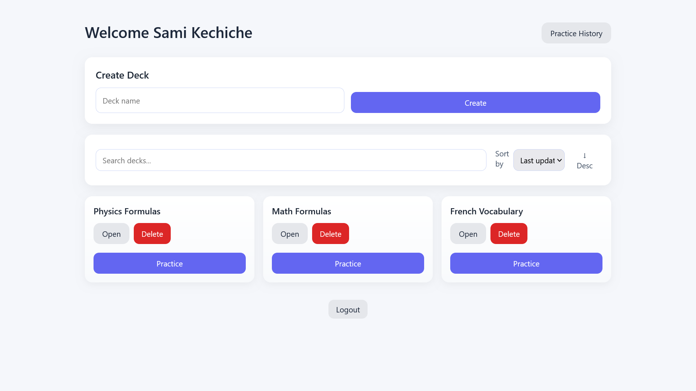
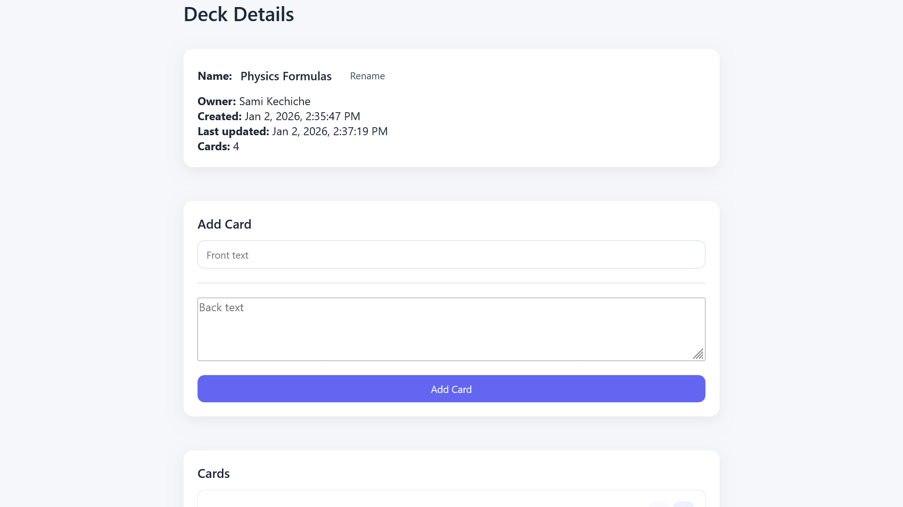
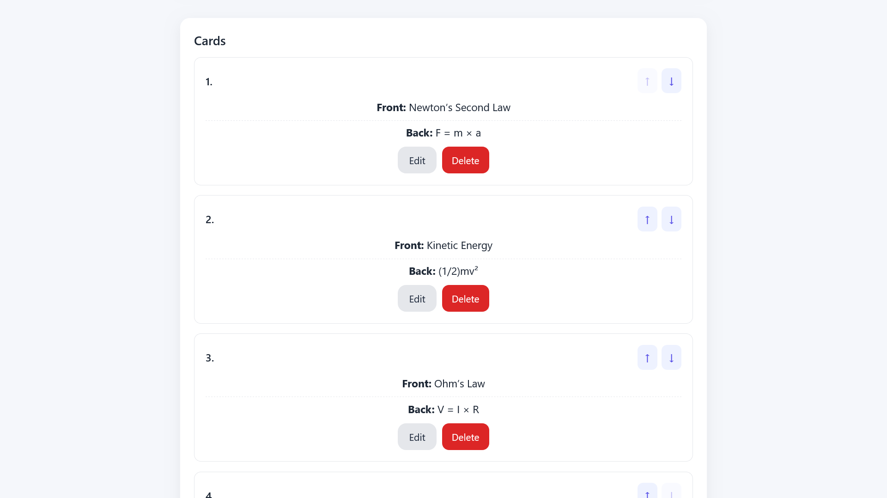
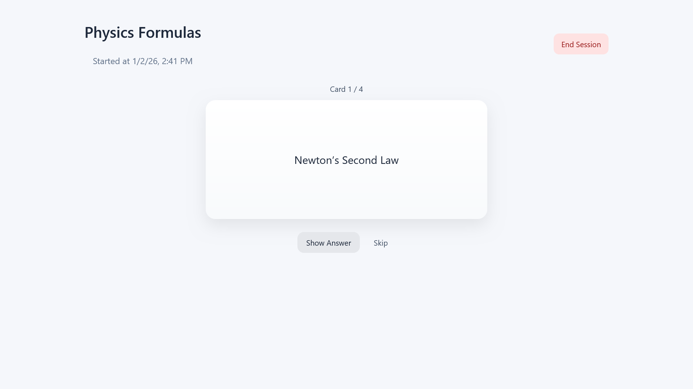
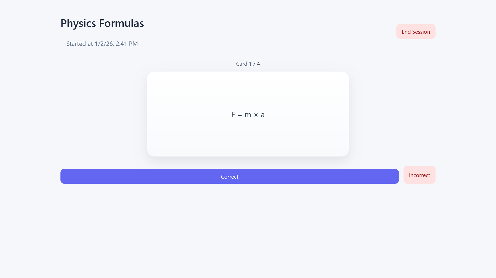
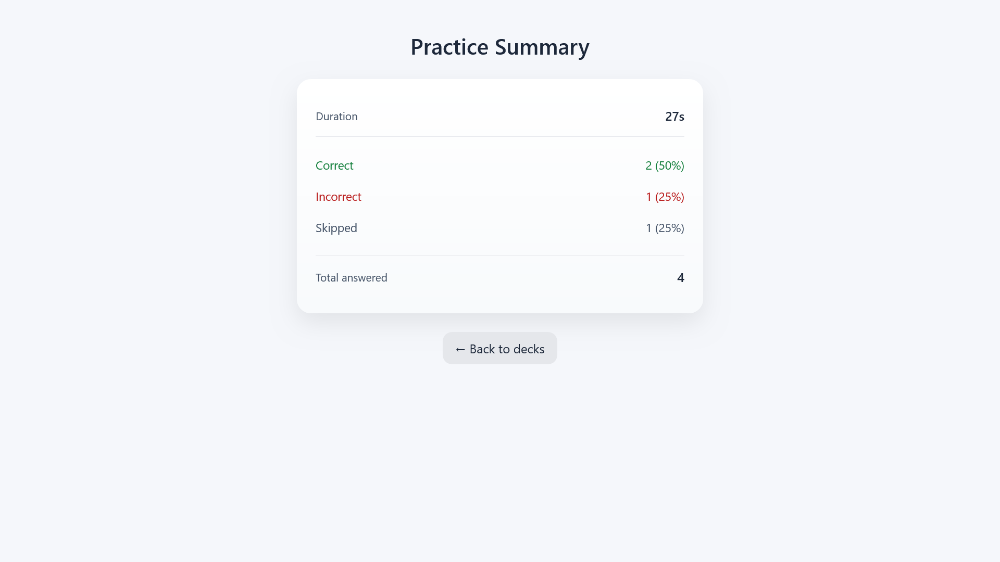
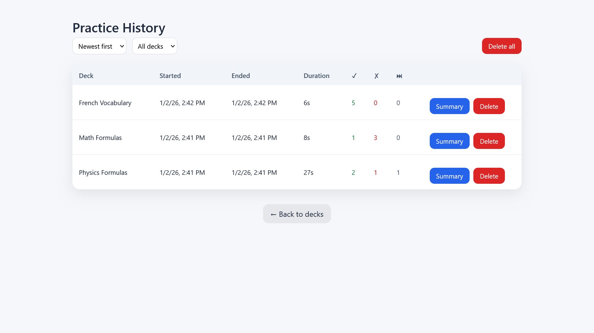

# MemoryDeck

MemoryDeck is a full-stack web-based flashcard learning application that allows users
to create decks, manage cards, practice efficiently, and track learning progress.

## Features

* User registration and authentication
* Deck and card management
* Practice sessions with self-assessment (correct / incorrect / skipped)
* Practice session summaries
* Practice history with filtering and sorting
* Clean and distraction-free learning interface

## Tech Stack

* Frontend: Angular
* Backend: ASP.NET Core (Web API)
* Database: Entity Framework Core (SQLite)

## Screenshots

### Deck List
Overview of all decks with access to practice sessions.



### Deck Details
Deck information, card creation, and card management.




### Practice Session
Flashcard practice flow with answer hidden and revealed states.




### Practice Summary
Session results with performance statistics.



### Practice History
History of completed sessions with filtering and sorting.




## Project Context

This project was developed as part of a university coursework project to practice
full-stack web development, REST API design, and UML-based system modeling.


---

## 🚀 Getting Started

This section explains how to set up and run the MemoryDeck application locally for development or testing purposes.

### 🛠️ Prerequisites

Before starting, ensure that the following tools are installed on your machine:

- **.NET 9.0 SDK**  
  Required to run the ASP.NET Core backend.  
  Download: https://dotnet.microsoft.com/download/dotnet/9.0

- **Node.js (v18 or higher)**  
  Required to run the Angular frontend.  
  Download: https://nodejs.org/

- **Angular CLI**  
  Used to build and serve the Angular application.  
  Install globally with:
  ```bash
  npm install -g @angular/cli
  ```

### ⚙️ Setup Instructions

1. **Clone the Repository**
  ```bash
  git clone <your-repository-url>
  cd memorydeck
  ```
2. **Backend Setup**

  Navigate to the backend directory and run the API:
  ```bash
  cd backend
  dotnet restore
  dotnet run
  ```

   The backend API will start at:  
   `http://localhost:5198`

   Swagger API documentation is available at:  
   `http://localhost:5198/swagger`

   A SQLite database file named `memorydeck.db` will be automatically created on first run using Entity Framework Core.

3. **Frontend Setup** (in a new terminal)

  Open a new terminal window, then navigate to the frontend directory:
  ```bash
  cd frontend
  npm install
  ng serve
  ```

   The Angular application will be available at:  
   `http://localhost:4200`

### Default Ports

- **Frontend**: `http://localhost:4200`
- **Backend**: `http://localhost:5198`
- **API Base URL**: `http://localhost:5198/api`

### Troubleshooting

- **Port already in use**: Update the frontend API URL in `environment.ts` or change the backend port in `appsettings.json`.
- **Database issues**: Stop the backend, delete `memorydeck.db`, and restart the API.
- **CORS errors**: Ensure that the backend is running before starting the frontend.

---

## 👤 Author

Sami Kechiche
